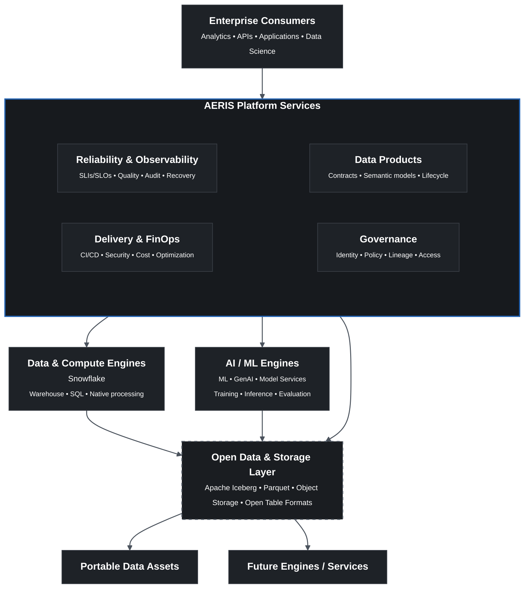

### AERIS — Short Description

> **AERIS (Adaptive Enterprise Reliability & Intelligence System)** is an extensible enterprise Data & AI platform that unifies data products, governance, reliability, and AI across Snowflake, Databricks, and open data technologies—enabling scalable, governed, and engine-agnostic data intelligence.

### Mermaid Architecture

